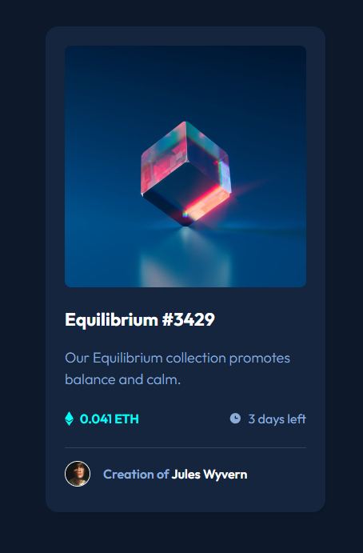
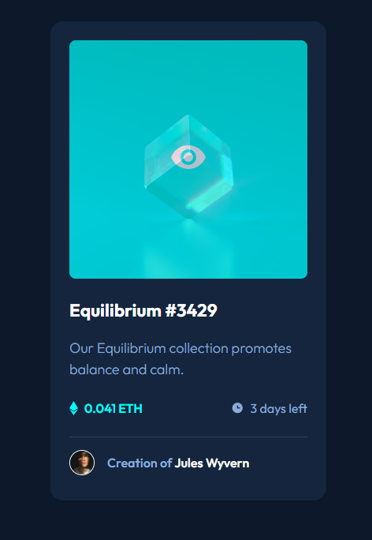

# Frontend Mentor - Nft preview card compontent solution

This is a solution to the [Nft preview card compontent challenge on Frontend Mentor](https://www.frontendmentor.io/challenges/nft-preview-card-component-SbdUL_w0U).

## Table of contents

- [Overview](#overview)
  - [Screenshot](#screenshot)
  - [Links](#links)
- [My process](#my-process)
  - [Built with](#built-with)
- [Author](#author)

## Overview

### Screenshots

### Links

- Solution URL: [Frontend Mentor IO Solution](https://www.frontendmentor.io/solutions/nft-preview-card-component-KXBspvEtpQ)
- Live Site URL: [Hosted on GitHub Pages](https://filipjanik.github.io/nft-preview-card-component/)

## My process

### Built with

- Semantic HTML5 markup
- CSS custom properties

## Author

- Frontend Mentor - [@filipjanik](https://www.frontendmentor.io/profile/filipjanik)
